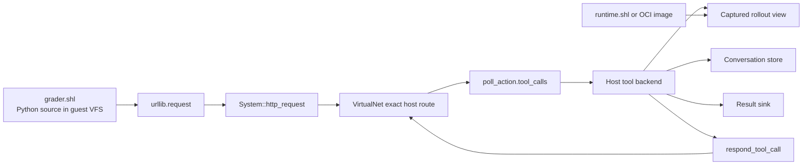
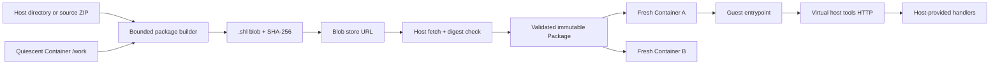
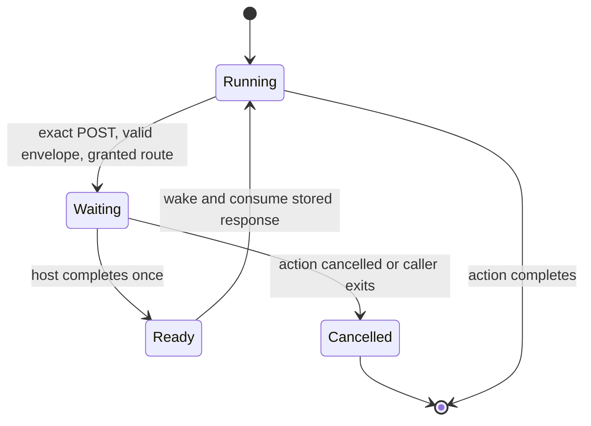

# `.shl` packages and host tools

## Decision

A `.shl` package contains a `/work` VFS tree, an entry command, limits, and a declaration of required host tools. It contains no host process and grants no access to the host's ambient filesystem or network. The host constructs a guest container with an explicit tool backend, then runs the package. A rollout runtime is a separate artifact: another `.shl` or an OCI image in Docker. The host captures the rollout's outputs and exposes only approved reads to the grader guest.

The guest calls tools through one exact **virtual HTTP endpoint**, `http://host.shellsim/tools`. Shellsim intercepts this URL before DNS or sockets. The request becomes a typed call in the next `poll_action` result. The host invokes its registered backend and supplies one result with `respond_tool_call`. This is a small, purpose-built protocol, not MCP: there is no initialize phase, tool discovery, JSON-RPC ID, streaming, session header, or duplicate text result. The pending HTTP request already has a request ID and belongs to one machine.



Shellsim knows the generic envelope and suspension mechanism, not `Grader`, `ChatContext`, Docker, conversations, or scores. The host owns those meanings. The URL is a virtual address, not an authority or credential. We use `host.shellsim` without `.invalid`; exact interception and an ungranted-route failure ensure no DNS lookup is attempted.

## Package format and lifecycle

Use a `.shl` ZIP archive as an immutable **workspace template**, not a serialized running machine. Version 1 maps `rootfs/<relative-path>` to `/work/<relative-path>`; it does not replace shellsim's built-in `/usr`, Python stdlib, process table, clock, environment, network routes, or resource counters. This matches the harness's existing `/work` file boundary and avoids pretending that a live Python or Wasm stack is portable. A snapshot of an existing `Container` is allowed only when no action, tool call, or non-shell process is live. Each instantiation creates a fresh machine, stages the validated files, installs its own host tool registry, and starts with fresh limits and usage.

```text
arithmetic-grader-0.1.0.shl
  shl.json
  rootfs/app/grader.py
  rootfs/app/host_tools.py
  rootfs/app/private/expected.json
```

`shl.json` is UTF-8 JSON. The Python SDK reads it on its supported Python 3.9 baseline without an additional parser dependency. The builder writes canonical JSON and a sorted ZIP with normalized metadata. The loader validates the **content**, not byte-for-byte ZIP canonicality. A shortened manifest follows; each file entry also carries its SHA-256 digest, byte size, and mode. Directory entries in the manifest preserve empty directories and their modes; they have no ZIP payload member.

```json
{
  "format": 1,
  "name": "arithmetic-grader",
  "version": "0.1.0",
  "entrypoint": ["python3.14", "/work/app/grader.py"],
  "working_directory": "/work",
  "requested_clock": "virtual",
  "required_tools": ["workspace.read_file", "conversation.list", "grade.submit"],
  "requires_c_toolchain": false,
  "limits": {"cpu": 1000000, "memory": 16777216, "disk": 16777216, "output": 65536},
  "entries": [
    {"type": "directory", "path": "app", "mode": 493},
    {"type": "file", "path": "app/grader.py", "mode": 420, "size": 812, "sha256": "..."}
  ]
}
```

The manifest declares every file payload as `rootfs/<path>`; the ZIP contains only those files and `shl.json`, with no undeclared members. Paths are canonical UTF-8, POSIX-style, relative to `/work`, nonempty, and free of `.`/`..`, backslashes, NUL, and duplicate or colliding file/directory names. Version 1 supports regular files and directories only: reject ZIP symlinks, special files, encryption, compression other than stored or DEFLATE, and unsupported format versions. The loader checks central-directory sizes and then actual streamed bytes and every digest **before** it constructs a container. Hard v1 bounds are 128 MiB for the ZIP blob, 128 MiB cumulative uncompressed payload, 64 MiB per file, and 10,000 entries including directories. The effective disk limit must also fit the staged VFS nodes. A failed build, fetch, validation, or staging step leaves no visible partially loaded container. Modes retain executable bits; uid, gid, and timestamps are normalized rather than copied. A canonical writer uses stable ordering and timestamps; the digest of the complete emitted `.shl` blob is its distribution identity. This borrows inventory ideas from [Python wheels](https://packaging.python.org/en/latest/specifications/binary-distribution-format/) but not their runtime contract.

There are three builder inputs with the same output format: a host directory, a ZIP of a host directory, or a quiescent `Container`'s `/work` snapshot. For the first two, the caller supplies package metadata and the directory contents become `/work` contents; a ZIP's optional enclosing folder is removed only with an explicit `strip_prefix`. The builder rejects source symlinks and special files, rather than silently following or omitting them. Export from a container needs a new, bounded native `snapshot_workspace` operation under the session lock: looping over `list_paths` and `read_file` would not give an atomic snapshot, and `HarnessSession::fork` is deliberately unavailable to host-tool sessions. The source container remains usable and unchanged after export. Host handlers and their captured objects are **never** serialized.

The Python API makes the validated `Package` object the reusable template:

```python
spec = shellsim.PackageSpec(
    name="arithmetic-grader",
    version="0.1.0",
    entrypoint=("python3.14", "/work/app/grader.py"),
    required_tools=("workspace.read_file", "conversation.list", "grade.submit"),
    limits=shellsim.Limits(),
)
package = shellsim.Package.build_from_directory("grader-root", spec=spec)
same_package = shellsim.Package.build_from_zip(source_zip_bytes, spec=spec)
snapshot_package = shellsim.Package.build_from_container(existing_container, spec=spec)
blob = package.to_bytes()
loaded = shellsim.Package.from_bytes(blob)
first = loaded.instantiate(tools=host_tools)
second = loaded.instantiate(tools=other_host_tools)
result = first.run_entrypoint()
```

`Package.from_bytes` validates once and retains immutable file bytes. `instantiate` constructs a new `Container` each time; no machine-state fork or copy-on-write is required. It checks that every `required_tools` name has a callable handler, passes **only those names** to the new container, and cannot grant itself any host capability. Unlisted handlers in the host's larger registry remain invisible. The manifest's limits are ceilings, not grants: effective limits are the per-field minimum of manifest limits and host-supplied limits (or the SDK defaults). The entrypoint is an argv array, never an arbitrary host command; `run_entrypoint()` quotes it into the existing simulated shell action after changing to the validated `/work` working directory. Ordinary `container.run(...)` remains available.

For a remote blob, fetching is an explicit **host** operation, separate from the guest's virtual HTTP route:

```python
package = shellsim.Package.from_url(
    blob_url,
    expected_sha256=known_digest,
    fetcher=blob_store.fetch,  # optional; the default fetcher accepts HTTPS only
)
container = package.instantiate(tools=host_tools)
result = container.run_entrypoint()
```

The default fetcher rejects redirects and non-HTTPS URLs, uses a 10-second timeout, and streams with the 128 MiB archive cap before parsing. A custom fetcher supplies byte chunks for `s3://`, signed URLs, or deterministic in-memory test stores; the loader applies the same cumulative cap and digest check. The host must still authorize where it fetches from: a digest detects changed bytes but does not make an attacker-chosen URL safe from SSRF. The guest never receives the blob URL or ambient network access. The package manifest names required tools; the host decides whether to provide them. An OCI rollout runtime stays a separate image identified by an [image digest](https://github.com/opencontainers/image-spec/blob/main/image-layout.md), not something wrapped in `.shl`.

The installed Python console runs packages that need no host tools with `shellsim run https://example.com/app.shl --sha256 <digest>` or `shellsim run ./app.shl` for local development. The digest is optional for a trusted URL, but pinning it detects a changed distribution. The CLI grants at most 400 billion CPU units, 512 MiB memory, 512 MiB disk, and 32 MiB output; `--cpu`, `--memory`, `--disk`, and `--output` set explicit host ceilings. The package cannot raise them. Packages requiring host tools run through the Python API so the caller can register handlers. The separate Rust executable's `run` command runs a host script path and does not load `.shl` packages.

The manifest's `requested_clock` is either `virtual` or `real_time`. The Python SDK boots virtual time unless the host explicitly passes `clock="real_time"` to `instantiate`; the installed CLI chooses to grant a package's real-time request. `Container.start_entrypoint()` returns an `Action` that yields complete virtual display frames and accepts bounded key events while one shell script compiles and runs a Wasm child. `shellsim.DisplayHost(action)` is a reusable loopback browser adapter; the CLI creates one when the first frame appears. Headless `run_entrypoint()` remains available for finite actions.

Archive parsing, URL fetching, and manifest validation live in the Python host SDK. The Rust core provides only bounded, atomic VFS export and guest execution; it has no host URL-fetch or ZIP-distribution responsibility. `PackageSpec` uses a frozen dataclass and explicit validation, with no Pydantic runtime dependency. The format is documented independently of the implementation so another host language can implement the same loader later.



`tests/python_package/test_packages_e2e.py` builds a grader from a directory and source ZIP, exports the same files from a container, fetches a `.shl` blob through an injected in-memory URL fetcher, instantiates it twice with distinct handler state, and runs its entrypoint. It checks guest tool calls, independent instance mutations, stable bytes, undeclared tools, malformed archives, and refusal to export a live action. No test needs real network or elapsed host time.

## Optional C toolchain

Install `shellsim[c]` to get the separately published `shellsim-c-toolchain` distribution. Its
wheel and sdist contain a pinned, prebuilt TinyCC WebAssembly binary, its support files, an
unpacked WASI C sysroot, corresponding TinyCC source, and license notices. The core `shellsim`
wheel and sdist do not contain these files. Ordinary guests do not install them.
Call `shellsim_c_toolchain.install_c_toolchain(container)` to install `/usr/bin/cc` in an
existing guest. Alternatively, set `PackageSpec(requires_c_toolchain=True)` when building a
`.shl`. This records an explicit requirement in `shl.json`; `Package.instantiate()` installs the
toolchain before the entrypoint
runs and reports a missing `shellsim[c]` extra if the toolchain distribution is absent. Existing
version-1 packages without this field continue to load with no C toolchain.
The Python host API stages each resource directly in the bounded guest VFS; no archive is made
or extracted. The JSON harness file API remains limited to `/work`. Compilation and linked Wasm
execution happen inside the guest. No host compiler or host filesystem path is exposed to the
guest. Set limits high enough for installation and compilation.
`toolchain/LICENSES/README.md` records asset provenance and corresponding source.

## Guest wire contract

The only host-backed route is `POST http://host.shellsim/tools` with a JSON body containing a nonempty `tool` string and an `arguments` object. For example:

```http
POST http://host.shellsim/tools
Content-Type: application/json

{"tool":"workspace.read_file","arguments":{"path":"/work/answer.txt"}}
```

The host result is one JSON object under `result`:

```json
{"result":{"data_base64":"NDIK"}}
```

An error is `{"error":"denied"}`. The guest wrapper raises on that value. File bytes are base64 because JSON cannot carry arbitrary bytes. The host validates tool-specific arguments and results; the core validates the generic envelope, result shape, body size, and bounded pending count. No tool name appears in shellsim core. The protocol intentionally has no tool listing: package requirements are checked by the host before launch, and the guest calls only names it knows.

The package can include this complete wrapper as source in `rootfs/app/host_tools.py`:

```python
import json
from urllib.request import Request, urlopen


class ToolClient:
    def call(self, name, arguments):
        request = Request(
            "http://host.shellsim/tools",
            data=json.dumps({"tool": name, "arguments": arguments}).encode(),
            headers={"Content-Type": "application/json"},
            method="POST",
        )
        with urlopen(request) as response:
            reply = json.loads(response.read().decode())
        if "error" in reply:
            raise RuntimeError(reply["error"])
        return reply["result"]
```

`tests/fixtures/host_tools/host_tools.py` is the executable copy. A package author can define `Container.read_file` with `client.call("workspace.read_file", ...)`, populate `ChatContext.conversation` from `conversation.list`, and call `Grader().grade(ctx)`. The bootstrap can submit its score with `grade.submit`. These classes are package code; they do not constrain other `.shl` applications.

The current Python VM can suspend HTTP calls made from ordinary scheduler-dispatched functions and methods, including this grader. It cannot suspend a tool call made inside a synchronous native callback or VM frame such as `__init__`, `__call__`, `__getitem__`, generator iteration, `sorted(key=...)`, or an imported module's top-level code. Such calls fail explicitly with `RuntimeError: host tools require scheduler-dispatched Python`. Package authors must keep tool calls in ordinary dispatched code until the VM supports continuations through those contexts. This is a VM limitation, not a requirement of the wire protocol.

## Python host API

The host registers ordinary Python callables when it creates `shellsim.Container`. No CLI, subprocess, event-loop plumbing, or JSON operation handling is required from the SDK user:

```python
import base64
from pathlib import Path
import shellsim

captured_workspace = {"/work/answer.txt": b"42\n"}
conversation = ["What is 6 * 7?"]
scores = []

def read_file(arguments):
    data = captured_workspace[arguments["path"]]
    return {"data_base64": base64.b64encode(data).decode()}

def list_conversation(arguments):
    return {"messages": conversation}

def submit_grade(arguments):
    scores.append(arguments["score"])
    return {"accepted": True}

container = shellsim.Container(tools={
    "workspace.read_file": read_file,
    "conversation.list": list_conversation,
    "grade.submit": submit_grade,
})
package_root = Path("unpacked-grader/rootfs/app")
container.write_file("/work/app/host_tools.py", (package_root / "host_tools.py").read_bytes())
container.write_file("/work/app/grader.py", (package_root / "grader.py").read_bytes())
result = container.run("python3.14 /work/app/grader.py")
assert result.returncode == 0
```

The `Container` owns a native `HarnessSession` in the same Python process. Its `run` method polls the simulated action, dispatches each named call to the registered Python handler, returns its object result or a tool error, and resumes the guest. A missing name returns `unknown tool`. A handler can raise `shellsim.ToolError` to deliberately expose an error message; other exceptions become the generic `tool failed` error so host diagnostics do not leak to the guest. The backend registry is not serialized into shellsim or made visible to guest code. `Container` supports file staging, `run`, and package-provided `run_entrypoint`; `Package` handles archive validation and instantiation.

## Underlying trampoline

The lower-level `HarnessSession` protocol remains available to Rust hosts and to `shellsim serve`, but it is an implementation boundary beneath the Python SDK. The Python SDK's native adapter calls typed `HarnessOperation` variants in-process; it does not launch the CLI. Embedded Rust hosts can construct `HarnessSession::with_clock_and_host_tools(...)` and dispatch themselves. CLI hosts can opt in at startup with `shellsim serve --host-tools`.

```json
{"op":"start_execute","source":"python3.14 /work/grader.py"}
{"op":"poll_action","action_id":0,"work_quanta":100000}
```

When guest code posts a tool request, `poll_action` returns an action view whose `tool_calls` contains the new calls. Each item has `request_id`, `tool`, and `arguments`; no separate drain operation is needed. A blocked action also reports `reason.kind = "host_http"` and its request ID. Calls are delivered at most once, even if the host polls again before replying.

```json
{"kind":"action","action_id":0,"state":{"state":"blocked","reason":{"kind":"host_http","request_id":0}},"tool_calls":[{"request_id":0,"tool":"workspace.read_file","arguments":{"path":"/work/answer.txt"}}]}
```

The Python SDK looks up the named tool in its construction-time registry and sends the equivalent typed operation to the native adapter:

```json
{"op":"respond_tool_call","request_id":0,"result":{"data_base64":"NDIK"}}
```

It then polls the action again. For failure it sends `{"op":"respond_tool_call","request_id":0,"error":"denied"}`. Exactly one of `result` or `error` is required. These JSON examples show the equivalent CLI wire representation, not steps a Python SDK caller writes. The request ID belongs to the host queue, not to guest-supplied JSON. The guest sees a normal HTTP 200 with the JSON envelope, and its wrapper interprets the tool error. The SDK hides unexpected host exceptions from the guest.

```mermaid
sequenceDiagram
    participant Guest as Guest Python or shell curl
    participant System as Shellsim system HTTP
    participant Host as shellsim.Container in Python host
    participant Backend as Tool backend
    Guest->>System: POST virtual /tools JSON
    System->>System: validate envelope, queue ID 0, suspend process
    Host->>System: poll_action(action_id)
    System-->>Host: blocked + tool_calls [{request_id: 0, tool, arguments}]
    Host->>Backend: call(tool, arguments)
    Backend-->>Host: result or error
    Host->>System: respond_tool_call(request_id=0, result=...)
    System->>System: store reply, wake process
    Host->>System: poll_action(action_id)
    System-->>Guest: HTTP 200 JSON; resume same request
    Guest-->>Host: action completes; read_action_output
```

The system layer handles HTTP for Python `urllib.request`, shell `curl`, and shell `wget`. `System::http_request` returns either `Ready(HttpResponse)` or `Blocked(request_id)`. Python and shell commands suspend using the same `WaitReason::HostHttp` and retry the pending operation when woken. `VirtualNet` recognizes the retry, returns the stored response, and never invokes an effectful tool twice. When a host reply is pending, virtual time does not jump to a timeout deadline before the host has a chance to respond. No Python-only callback or real socket is involved. A synchronous `execute` cannot service callbacks, so granted sessions use `start_execute` and `poll_action`. There is no Wasm HTTP API in this slice.



## Two packages and a container protocol

The rollout runtime and grader need not share an execution engine. The host binds a **captured rollout view** to the grader's tool backend. A shellsim runtime can yield a bounded VFS snapshot; a Docker runtime can yield a copied workspace and conversation record. Both adapters implement the same read-only tool schemas. A Docker rollout should be paused or stopped before capture; [Docker copy](https://docs.docker.com/reference/cli/docker/container/cp/) can export files, while [committing an image omits mounted volume contents](https://docs.docker.com/reference/cli/docker/container/commit/). The adapter must handle or reject mounts, symlinks, traversal, special files, and oversized reads. The grader cannot modify the runtime via these read tools. `grade.submit` is a separate, explicit host effect.

Each `Container` has its own registry and machine. Other machines with the same virtual URL get their own backend or no route. The package loader checks that required tools are present and installs only those handlers; the host remains responsible for deciding whether to supply them. Host-enabled sessions cannot currently be forked; regranting and in-flight-call semantics would need an explicit design. The bridge bounds each message to 1 MiB and pending requests to 16. An oversized host result becomes a bounded guest-visible `tool response too large` error, not a failed host action. Tool calls are intended for the foreground action: a completed action discards unanswered calls, and later actions reject requests from its background descendants. Background descendants with reaped parents can lose requests, and discarded callers may remain blocked; packages must not rely on background tool calls. Production host code must also cap file pages, aggregate bytes, backend execution time, and output size. Cancellation removes queued calls and rejects late replies. For replay, record package and rollout digests, tool names and argument/result digests, and the complete tool replies in order; the Docker rollout itself may not be deterministic.

## What exists and what remains

The transport and Python-hosted end-to-end test exist now. `tests/python_package/test_host_tools_e2e.py` uses the public `shellsim.Container(tools=...)` API, stages package-owned source, runs `Grader().grade(ctx)` inside shellsim, and exercises the same virtual route from `curl` and `wget`. It does not launch or speak to the CLI. Run it with `uv run --with pytest pytest -q tests/python_package/test_host_tools_e2e.py`; `uv` builds the checked-out Python extension. `tests/host_tools.rs` covers one-shot delivery, cancellation, and an ungranted route.

The `.shl` builder, loader, manifest validator, host-side URL fetcher, and atomic quiescent workspace snapshot exist in this slice. Docker rollout capture and application-specific tool policy are not part of the package format; a host can bind a captured rollout view to its handlers. A useful next integration is to run the same grader package against captured shellsim and Docker rollouts with identical tool names and schemas.

## Doom package stress test

The URL-runner test packages the pinned TinyCC fixture, C source, and a guest build script in one `.shl`. `shellsim run` fetches the blob through the host loader; the guest extracts TinyCC, compiles the source to Wasm, and runs the result. The test uses an in-memory fetcher so it is deterministic and does not depend on an external blob store.

The generic package path supports a 64 MiB file bound, a 128 MiB archive and payload bound, host-selected real-time clock, guest-side Wasm compilation, host-driven display frames and keys, and a reusable browser adapter. A guest shell script remains the package's only entrypoint. The shell-launched Wasm child yields after each successful frame presentation, so the host can inject a key before resuming the same action.

The Doom PR still needs a builder for one URL-addressed distribution of engine source, WAD, compiler, sysroot, and platform adapter, with their licenses and provenance. Its Rust-specific browser server can be replaced by the generic `DisplayHost` API. A full Doom integration remains opt-in when external source and WAD inputs are not available in CI.
