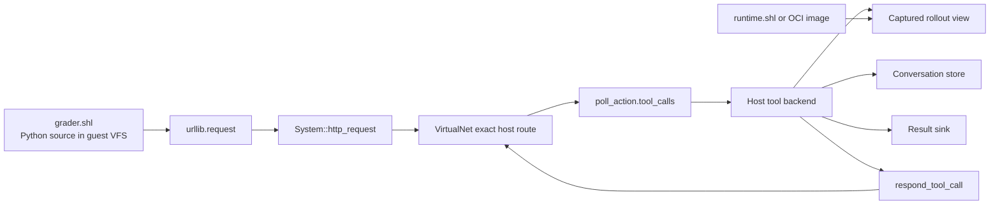
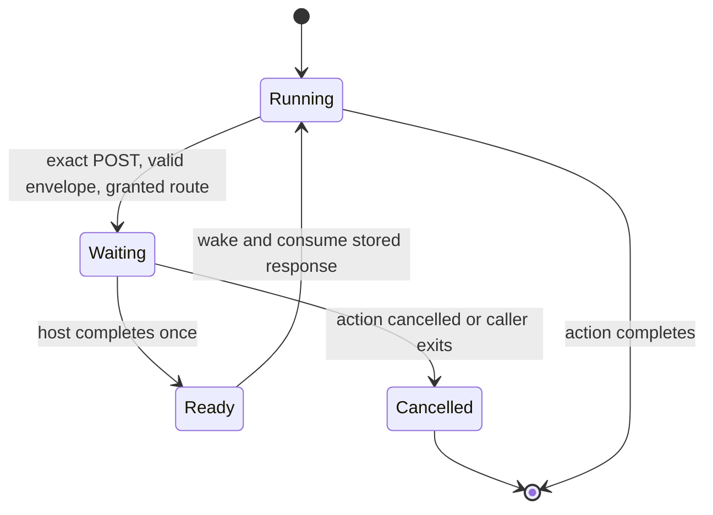

# `.shl` packages and host tools

## Decision

A `.shl` package should contain a shellsim VFS tree, an entry command, limits, and a declaration of required host tools. It should not contain a host process or have access to the host's ambient filesystem or network. The host constructs a guest container with an explicit tool backend, then runs the package. A rollout runtime is a separate artifact: another `.shl` or an OCI image in Docker. The host captures the rollout's outputs and exposes only approved reads to the grader guest.

The guest calls tools through one exact **virtual HTTP endpoint**, `http://host.shellsim/tools`. Shellsim intercepts this URL before DNS or sockets. The request becomes a typed call in the next `poll_action` result. The host invokes its registered backend and supplies one result with `respond_tool_call`. This is a small, purpose-built protocol, not MCP: there is no initialize phase, tool discovery, JSON-RPC ID, streaming, session header, or duplicate text result. The pending HTTP request already has a request ID and belongs to one machine.



Shellsim knows the generic envelope and suspension mechanism, not `Grader`, `ChatContext`, Docker, conversations, or scores. The host owns those meanings. The URL is a virtual address, not an authority or credential. We use `host.shellsim` without `.invalid`; exact interception and an ungranted-route failure ensure no DNS lookup is attempted.

## Package format proposal

```text
arithmetic-grader-0.1.0.shl
  shl.toml
  SHA256SUMS
  rootfs/app/host_tools.py
  rootfs/app/grader.py
  rootfs/app/private/expected.json
```

```toml
format = 1
name = "arithmetic-grader"
version = "0.1.0"
shellsim_abi = "1"

[application]
command = ["python3.14", "/app/grader.py"]
working_directory = "/app"

[host_tools]
required = ["workspace.read_file", "conversation.list", "grade.submit"]

[limits]
cpu = 1000000
memory_bytes = 16777216
disk_bytes = 16777216
output_bytes = 65536
```

`host_tools.py` and `grader.py` are ordinary source files authored by the package developer. A loader would copy them into the guest VFS. They are **not** built into shellsim's Python stdlib. The stdlib supplies `urllib.request` and `json`; the package supplies its Python wrapper and application contract. The current test stages these files with `write_file` because the `.shl` archive loader is not implemented yet.

A future loader should read `required`, check the backend registry and policy, and reject construction if a required tool is missing or denied. The current `Container` API registers handlers directly but does not load manifests. A declaration asks for access; it cannot grant itself access. Package metadata should be a canonical ZIP inventory with bounded members, per-member hashes, and a whole-archive digest. Reject duplicate names, traversal, symlinks, special files, and oversized entries before mounting. This borrows packaging ideas from [Python wheels](https://packaging.python.org/en/latest/specifications/binary-distribution-format/) but does not reuse the wheel runtime contract. An OCI runtime should be identified by an [image digest](https://github.com/opencontainers/image-spec/blob/main/image-layout.md), not wrapped in `.shl`.

## Guest wire contract

The only host-backed route is `POST http://host.shellsim/tools` with a JSON body containing a nonempty `tool` string and an `arguments` object. For example:

```http
POST http://host.shellsim/tools
Content-Type: application/json

{"tool":"workspace.read_file","arguments":{"path":"/work/answer.txt"}}
```

The host result is one JSON object under `result`:

```json
{"result":{"data_base64":"NDIK"}}
```

An error is `{"error":"denied"}`. The guest wrapper raises on that value. File bytes are base64 because JSON cannot carry arbitrary bytes. The host validates tool-specific arguments and results; the core validates the generic envelope, result shape, body size, and bounded pending count. No tool name appears in shellsim core. The protocol intentionally has no tool listing: package requirements are checked by the host before launch, and the guest calls only names it knows.

The package can include this complete wrapper as source in `rootfs/app/host_tools.py`:

```python
import json
from urllib.request import Request, urlopen


class ToolClient:
    def call(self, name, arguments):
        request = Request(
            "http://host.shellsim/tools",
            data=json.dumps({"tool": name, "arguments": arguments}).encode(),
            headers={"Content-Type": "application/json"},
            method="POST",
        )
        with urlopen(request) as response:
            reply = json.loads(response.read().decode())
        if "error" in reply:
            raise RuntimeError(reply["error"])
        return reply["result"]
```

`tests/fixtures/host_tools/host_tools.py` is the executable copy. A package author can define `Container.read_file` with `client.call("workspace.read_file", ...)`, populate `ChatContext.conversation` from `conversation.list`, and call `Grader().grade(ctx)`. The bootstrap can submit its score with `grade.submit`. These classes are package code; they do not constrain other `.shl` applications.

The current Python VM can suspend HTTP calls made from ordinary scheduler-dispatched functions and methods, including this grader. It cannot suspend a tool call made inside a synchronous native callback or VM frame such as `__init__`, `__call__`, `__getitem__`, generator iteration, `sorted(key=...)`, or an imported module's top-level code. Such calls fail explicitly with `RuntimeError: host tools require scheduler-dispatched Python`. Package authors must keep tool calls in ordinary dispatched code until the VM supports continuations through those contexts. This is a VM limitation, not a requirement of the wire protocol.

## Python host API

The host registers ordinary Python callables when it creates `shellsim.Container`. No CLI, subprocess, event-loop plumbing, or JSON operation handling is required from the SDK user:

```python
import base64
from pathlib import Path
import shellsim

captured_workspace = {"/work/answer.txt": b"42\n"}
conversation = ["What is 6 * 7?"]
scores = []

def read_file(arguments):
    data = captured_workspace[arguments["path"]]
    return {"data_base64": base64.b64encode(data).decode()}

def list_conversation(arguments):
    return {"messages": conversation}

def submit_grade(arguments):
    scores.append(arguments["score"])
    return {"accepted": True}

container = shellsim.Container(tools={
    "workspace.read_file": read_file,
    "conversation.list": list_conversation,
    "grade.submit": submit_grade,
})
package_root = Path("unpacked-grader/rootfs/app")
container.write_file("/work/host_tools.py", (package_root / "host_tools.py").read_bytes())
container.write_file("/work/grader.py", (package_root / "grader.py").read_bytes())
result = container.run("python3.14 /work/grader.py")
assert result.returncode == 0
```

The `Container` owns a native `HarnessSession` in the same Python process. Its `run` method polls the simulated action, dispatches each named call to the registered Python handler, returns its object result or a tool error, and resumes the guest. A missing name returns `unknown tool`. A handler can raise `shellsim.ToolError` to deliberately expose an error message; other exceptions become the generic `tool failed` error so host diagnostics do not leak to the guest. The backend registry is not serialized into shellsim or made visible to guest code. `Container` currently supports `write_file`, `read_file`, and `run`; package loading and manifest checking are separate future work.

## Underlying trampoline

The lower-level `HarnessSession` protocol remains available to Rust hosts and to `shellsim serve`, but it is an implementation boundary beneath the Python SDK. The Python SDK's native adapter calls typed `HarnessOperation` variants in-process; it does not launch the CLI. Embedded Rust hosts can construct `HarnessSession::with_clock_and_host_tools(...)` and dispatch themselves. CLI hosts can opt in at startup with `shellsim serve --host-tools`.

```json
{"op":"start_execute","source":"python3.14 /work/grader.py"}
{"op":"poll_action","action_id":0,"work_quanta":100000}
```

When guest code posts a tool request, `poll_action` returns an action view whose `tool_calls` contains the new calls. Each item has `request_id`, `tool`, and `arguments`; no separate drain operation is needed. A blocked action also reports `reason.kind = "host_http"` and its request ID. Calls are delivered at most once, even if the host polls again before replying.

```json
{"kind":"action","action_id":0,"state":{"state":"blocked","reason":{"kind":"host_http","request_id":0}},"tool_calls":[{"request_id":0,"tool":"workspace.read_file","arguments":{"path":"/work/answer.txt"}}]}
```

The Python SDK looks up the named tool in its construction-time registry and sends the equivalent typed operation to the native adapter:

```json
{"op":"respond_tool_call","request_id":0,"result":{"data_base64":"NDIK"}}
```

It then polls the action again. For failure it sends `{"op":"respond_tool_call","request_id":0,"error":"denied"}`. Exactly one of `result` or `error` is required. These JSON examples show the equivalent CLI wire representation, not steps a Python SDK caller writes. The request ID belongs to the host queue, not to guest-supplied JSON. The guest sees a normal HTTP 200 with the JSON envelope, and its wrapper interprets the tool error. The SDK hides unexpected host exceptions from the guest.

```mermaid
sequenceDiagram
    participant Guest as Guest Python or shell curl
    participant System as Shellsim system HTTP
    participant Host as shellsim.Container in Python host
    participant Backend as Tool backend
    Guest->>System: POST virtual /tools JSON
    System->>System: validate envelope, queue ID 0, suspend process
    Host->>System: poll_action(action_id)
    System-->>Host: blocked + tool_calls [{request_id: 0, tool, arguments}]
    Host->>Backend: call(tool, arguments)
    Backend-->>Host: result or error
    Host->>System: respond_tool_call(request_id=0, result=...)
    System->>System: store reply, wake process
    Host->>System: poll_action(action_id)
    System-->>Guest: HTTP 200 JSON; resume same request
    Guest-->>Host: action completes; read_action_output
```

The system layer handles HTTP for Python `urllib.request`, shell `curl`, and shell `wget`. `System::http_request` returns either `Ready(HttpResponse)` or `Blocked(request_id)`. Python and shell commands suspend using the same `WaitReason::HostHttp` and retry the pending operation when woken. `VirtualNet` recognizes the retry, returns the stored response, and never invokes an effectful tool twice. When a host reply is pending, virtual time does not jump to a timeout deadline before the host has a chance to respond. No Python-only callback or real socket is involved. A synchronous `execute` cannot service callbacks, so granted sessions use `start_execute` and `poll_action`. There is no Wasm HTTP API in this slice.



## Two packages and a container protocol

The rollout runtime and grader need not share an execution engine. The host binds a **captured rollout view** to the grader's tool backend. A shellsim runtime can yield a bounded VFS snapshot; a Docker runtime can yield a copied workspace and conversation record. Both adapters implement the same read-only tool schemas. A Docker rollout should be paused or stopped before capture; [Docker copy](https://docs.docker.com/reference/cli/docker/container/cp/) can export files, while [committing an image omits mounted volume contents](https://docs.docker.com/reference/cli/docker/container/commit/). The adapter must handle or reject mounts, symlinks, traversal, special files, and oversized reads. The grader cannot modify the runtime via these read tools. `grade.submit` is a separate, explicit host effect.

Each `Container` has its own registry and machine. Other machines with the same virtual URL get their own backend or no route. The proposed package loader must validate required tools against host policy before constructing the container. Host-enabled sessions cannot currently be forked; regranting and in-flight-call semantics would need an explicit design. The bridge bounds each message to 1 MiB and pending requests to 16. An oversized host result becomes a bounded guest-visible `tool response too large` error, not a failed host action. Tool calls are intended for the foreground action: a completed action discards unanswered calls, and later actions reject requests from its background descendants. Background descendants with reaped parents can lose requests, and discarded callers may remain blocked; packages must not rely on background tool calls. Production host code must also cap file pages, aggregate bytes, backend execution time, and output size. Cancellation removes queued calls and rejects late replies. For replay, record package and rollout digests, tool names and argument/result digests, and the complete tool replies in order; the Docker rollout itself may not be deterministic.

## What exists and what remains

The transport and Python-hosted end-to-end test exist now. `tests/python_package/test_host_tools_e2e.py` uses the public `shellsim.Container(tools=...)` API, stages package-owned source, runs `Grader().grade(ctx)` inside shellsim, and exercises the same virtual route from `curl` and `wget`. It does not launch or speak to the CLI. Run it with `uv run --with pytest pytest -q tests/python_package/test_host_tools_e2e.py`; `uv` builds the checked-out Python extension. `tests/host_tools.rs` covers one-shot delivery, cancellation, and an ungranted route.

There is no `.shl` loader, manifest validator, rollout-capture adapter, or package-to-tool policy check yet. The next implementation should add the package loader and validate `required` against the tool registry before constructing the container. Then run the same grader package against a captured shellsim rollout and a captured Docker rollout, with identical tool names and schemas.
